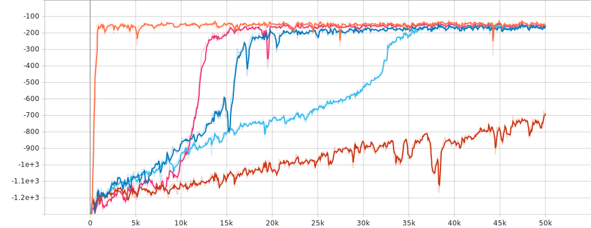
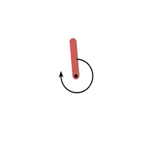
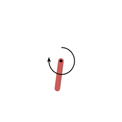
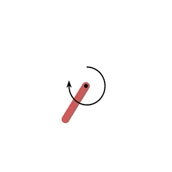
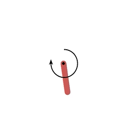
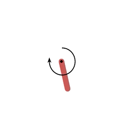

# Policy Gradient (Pendulum-v0)

Tensorboard.dev: [Policy Gradient (Pendulum-v0)](https://tensorboard.dev/experiment/aQPNeFojRRi73ODaoXn7LA/#scalars)

|  REINFORCE |  REINFORCE with baseline |  Deep DPG |  TRPO |  PPO |
|:-:|:-:|:-:|:-:|:-:|
|  |  |  |  |  |

